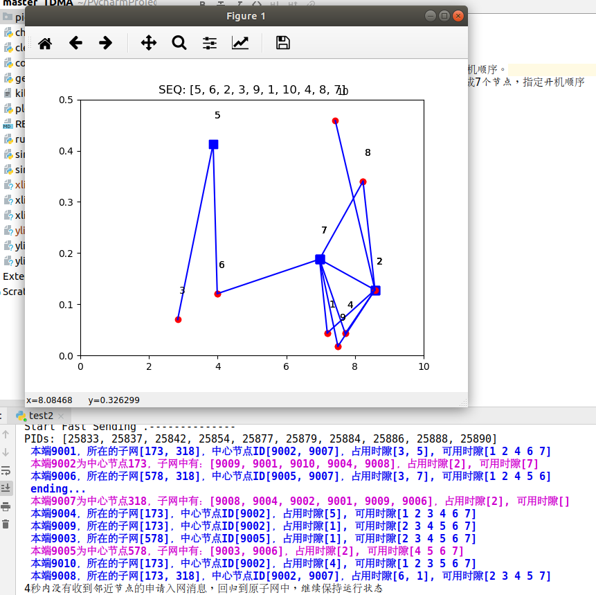
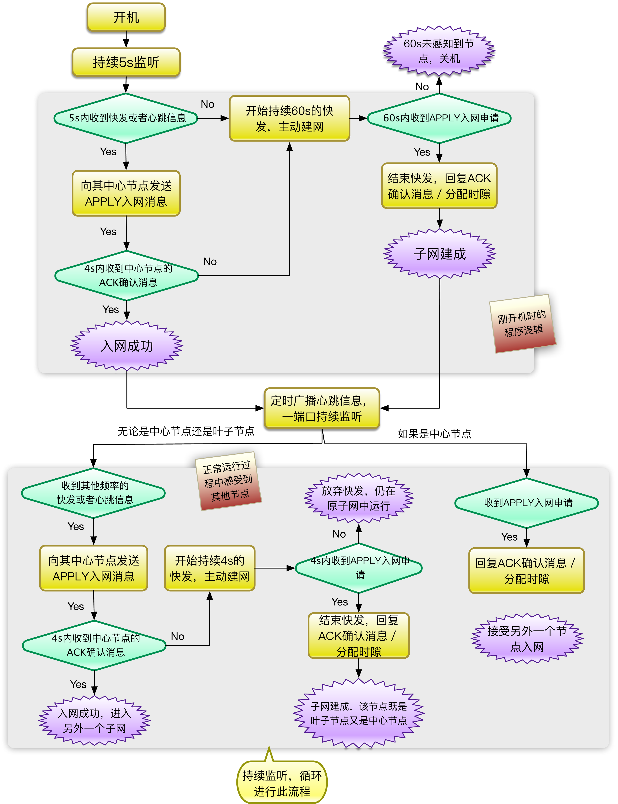

# master_TDMA
### 运行
执行run.py
可以在shell_cmd中自定义运行参数：
+ 如果只指定--num=7，则随机生成7个节点，随机生成开机顺序。
+ 指定--num=7, --seq='1,2,3,4,5,6,7',则随机生成7个节点，指定开机顺序
代码结构：
+ simulate：每个节点的执行逻辑
+ simulate_batch：按照开机顺序依次开机各个节点，执行逻辑
+ generate_node: 生成随机的网络拓扑,xlist,ylist为全局网络拓扑文件
+ clear_process和kill_port：用于解决端口占用问题
### 结果

### 程序流程图

